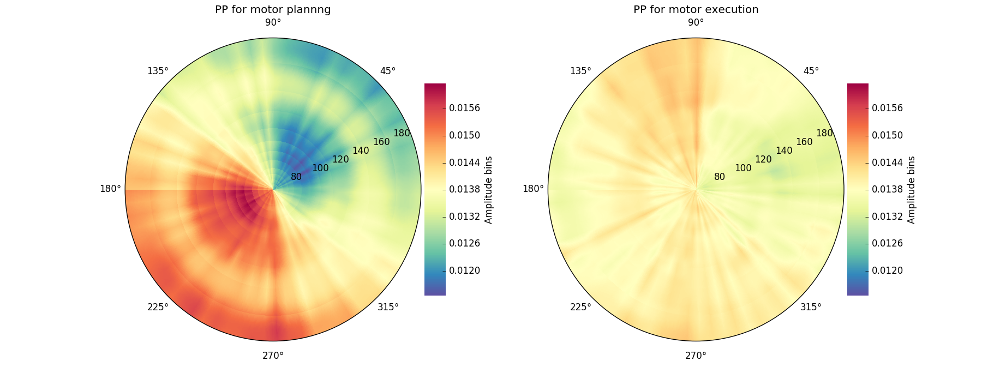
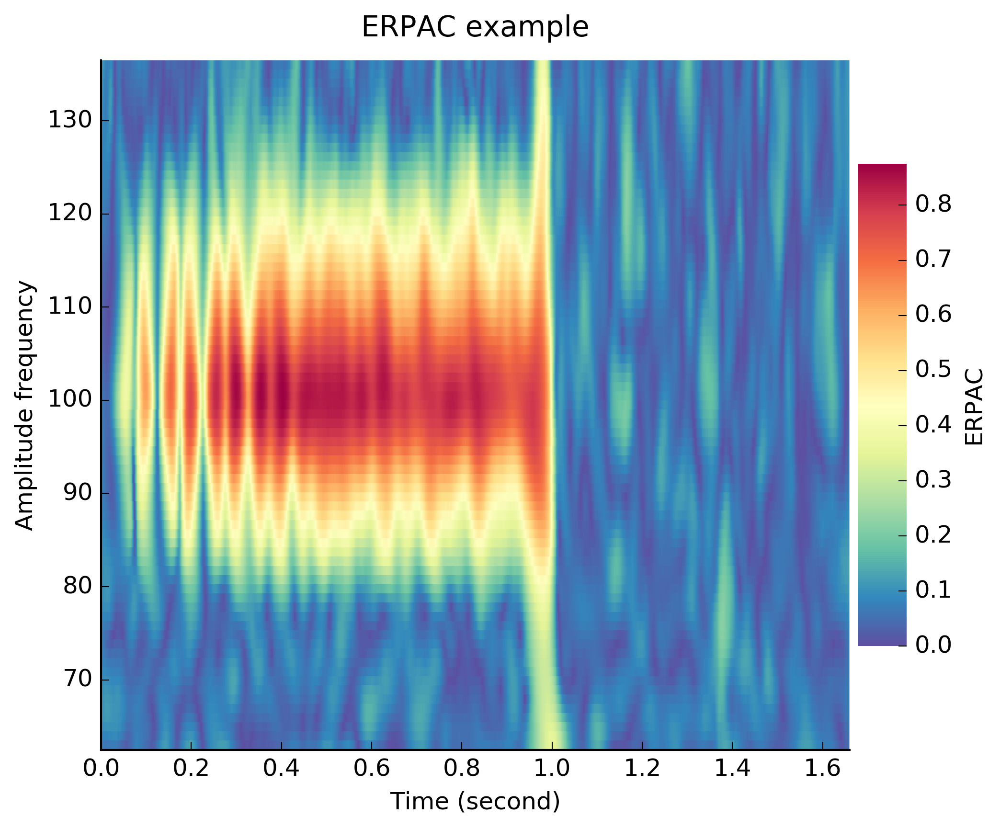
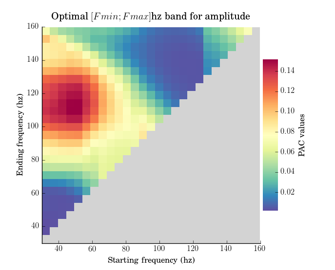

.. _api:

API
===

* :ref:`fcncfc` : methods for extracting Phase-Amplitude Coupling (PAC), Preferred phase and Event Related Pac. 
* :ref:`fcnvizu` : visualization methods
* :ref:`fcnutils` : utility functions.

.. _fcncfc:

Cross-frequency coupling measures
~~~~~~~~~~~~~~~~~~~~~~~~~~~~~~~~~

The first step for PAC computation is to define a `pacobj`. From there, we can use one of the following methods :

* :ref:`filtdata` : use this method to extract the phase and the amplitude separately.
* :ref:`pacfilt` : if you already extracted your phase and amplitude, use this method to compute PAC on it. 
* :ref:`filtpac` : all in one method which extract the phase and the amplitude and return the PAC measure.
* :ref:`pp` : compute the Preferred-Phase (PP).
* :ref:`erpac` : compute the Event-Related Phase-Amplitude Coupling (ERPAC, Voytek et al. 2013).

.. _pacobj:

PAC object
++++++++++

.. code-block:: python

    from tensorpac import Pac

.. autoclass:: tensorpac.pac.Pac

.. _filtdata:

Filter the data
+++++++++++++++

This method is used to filter the data only in order to extract phase and amplitude.

.. automethod:: tensorpac.pac.Pac.filter

.. _pacfilt:

Compute PAC on filtered data
++++++++++++++++++++++++++++

For those who already have filtered and computed the phase and amplitude, use this method to compute PAC.

.. automethod:: tensorpac.pac.Pac.fit

.. _filtpac:

Filter then compute PAC
+++++++++++++++++++++++

Use the following method to filter and compute the PAC directly.

.. automethod:: tensorpac.pac.Pac.filterfit

.. _pp:

Preferred-phase
+++++++++++++++

Compute the preferred-phase (PP, see `this PP example <https://github.com/EtienneCmb/tensorpac/tree/master/examples/12_PreferredPhase.py>`_). 

   Example of preferred-phase for a motor task. This show how the amplitude is distributed according to phase values during a motor planning phase and a motor execution phase.  

.. automethod:: tensorpac.pac.Pac.pp

.. _erpac:

Event-Related Phase-Amplitude Coupling
++++++++++++++++++++++++++++++++++++++

Compute the ERPAC (see `this ERPAC example <https://github.com/EtienneCmb/tensorpac/tree/master/examples/13_EventRelatedPAC.py>`_). 

   Example of Event-Related Phase-Amplitude Coupling (ERPAC, Voytek et al. 2013)

.. automethod:: tensorpac.pac.Pac.erpac

.. _fcnvizu:

Visualization
~~~~~~~~~~~~~

If matplotlib is installed on your system, the main Pac class already includes several plotting functions :

* :ref:`pltpac` : standard plotting function for 2D arrays.
* :ref:`pltcomo` : comodulogram plot, for finding the coupling location *PAC(phase, amplitude)*
* :ref:`plttri` : triangular plot for finding where each band [Start, Stop] and the bandwidth *PAC(Starting frequency, Ending frequency)*
* :ref:`pltpp` : polar plot for the preferred-phase representation *PP(phase, binned amplitude)*
* :ref:`pltshow` : show the figure
* :ref:`pltsave` : save the figure

plotting method that relies on Matplotlib. This script is also present in the `example <https://github.com/EtienneCmb/tensorpac/blob/master/examples/9_PlayWithColors.py>`_ folder.

.. _pltpac:

2D plot
+++++++

.. automethod:: tensorpac.pac.Pac.pacplot

.. _pltcomo:

Comodulogram
++++++++++++

.. figure::  picture/9_plot.png
   :align:   center

   Comodulogram forms.

.. automethod:: tensorpac.pac.Pac.comodulogram

.. _plttri:

Triangular plot
+++++++++++++++

.. automethod:: tensorpac.pac.Pac.triplot

.. _pltpp:

Polar plot
++++++++++

.. automethod:: tensorpac.pac.Pac.triplot

.. _pltshow:

Show
++++

.. automethod:: tensorpac.pac.Pac.show

.. _pltsave:

Save
++++

.. automethod:: tensorpac.pac.Pac.savefig

.. _fcnutils:

Utils
~~~~~

Generate artificially coupled signals using Tort method
+++++++++++++++++++++++++++++++++++++++++++++++++++++++
.. autofunction:: tensorpac.utils.pac_signals_tort

Generate artificially coupled signals using wavelets
++++++++++++++++++++++++++++++++++++++++++++++++++++
.. autofunction:: tensorpac.utils.pac_signals_wavelet

Generate phase and amplitude vectors
++++++++++++++++++++++++++++++++++++
.. autofunction:: tensorpac.utils.pac_vec

Generate triangular vectors
+++++++++++++++++++++++++++
.. autofunction:: tensorpac.utils.pac_trivec

Statistics
~~~~~~~~~~

Pearson correlation
+++++++++++++++++++

.. autofunction:: tensorpac.stats.pearson

Circular correlation
++++++++++++++++++++

.. autofunction:: tensorpac.stats.circ_corrcc
