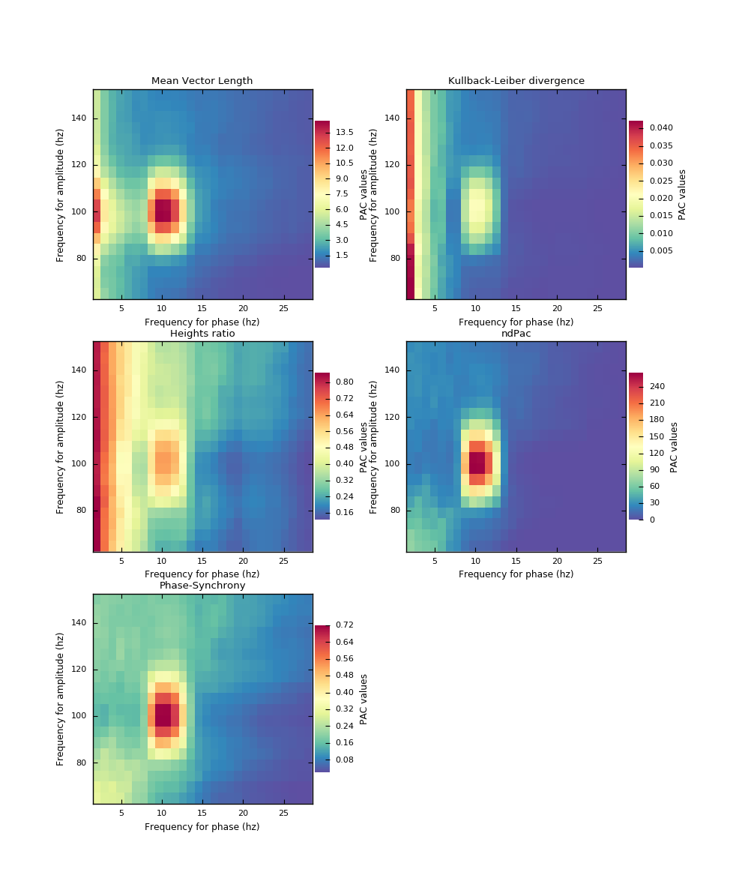
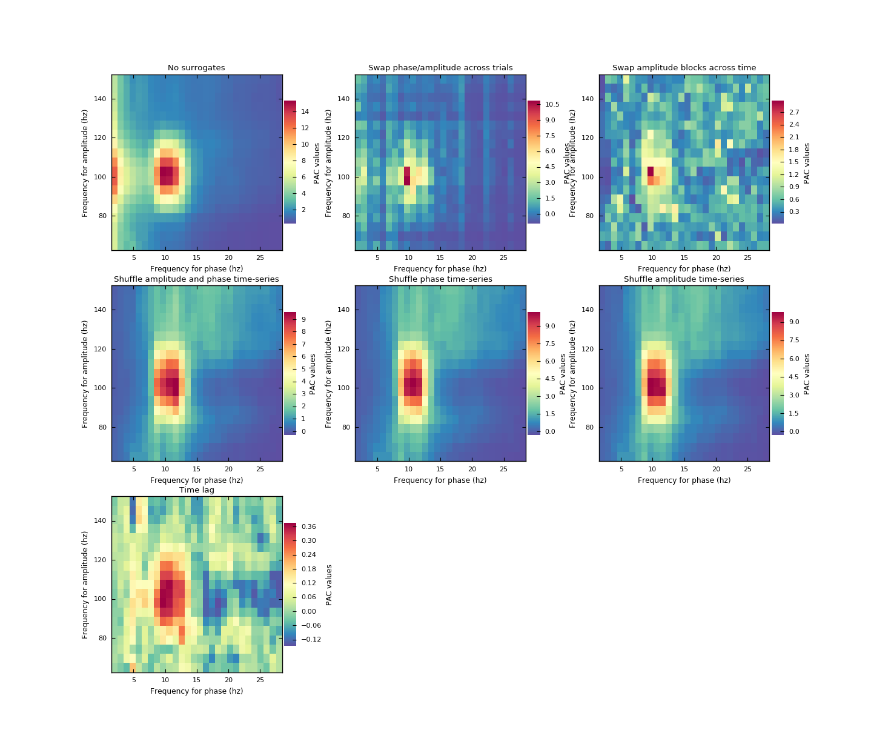
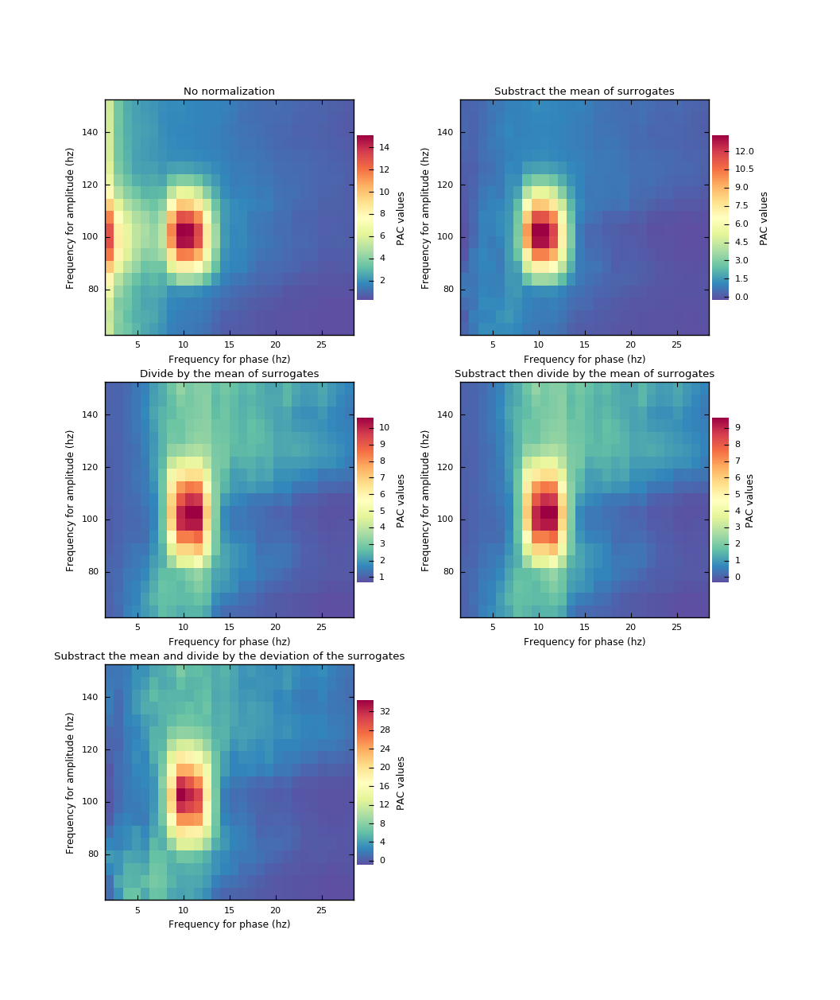

.. _Methods:

Implemented methods
===================

Starting from fresh data, the first thing that need to be assessed is extracting the phase and the amplitude in several frequency bands. There is two ways to doing it :

* Filter the data in the frequency band, then, use the hilbert transform to pass from the real space, to the complex one. 
* Convolve your data with a wavelet with a width, corresponding to the desired frequency band.

Finally, extract the phase and the amplitude from this complex decomposition. Once you have both signals, you can compute the PAC which rely on three steps :

* **Compute the PAC :**  from the two time series of phase and amplitude, you'll get one value of coupling
* **Compute surogates :** the PAC measure is really sensible to the noise present in the data. In addition, filtering could occur artefacts. To minimize those effects, we compute surrogates. Basically, the surrogates are obtained by changing a little bit either the phase or the amplitude and re-compute the PAC on it. This procedure is then repeated 50, 100, 200 or 1000 times to get a reliable distribution.
* **Correct the PAC measurement :** once you have the PAC and the distribution of surrogates, you can, for example, substract the mean of the surrogates. When you take the mean of a distribution only strong events survive hence, noise and artefacts should be reduced.

Across the litterature, a lot of methodologies for those three previous steps have been proposed and compared. But, how is it possible to conclude if a PAC pipeline is more efficient rather than an other if those three steps are different? Maybe taking the PAC method from one paper, combined with another one might be better?

Modular philosophy
------------------

To answer to this question, we propose a modular implementation of the phase amplitude coupling which means that you can mix methods. On top of that, every calculation is assessed using tensor and parallel computing which should provide fast performances.
To pick methods you want, you'll have to define the **idpac** tuple (or list/array) of three digits, each one referring to one of the implemented methods. 

Pac methods
~~~~~~~~~~~

The first digit refer to the PAC method :

* 1 - Mean Vector Length (MVL - Canolty, 2006)
* 2 - Kullback-Leibler Divergence (KLD - Tort, 2010)
* 3 - Heigth-ratio (HR - Lakata, 2005)
* 4 - Normalized Direct PAC (ndPAC - Ozkürt, 2012)
* 5 - Phase Synchrony (PS - Lakata, 2005)
* 6 - Generalized Linear Model (GLM - Lakata, 2005) [IN PROGRESS]
* 7 - Event Related PAC (ERPAC - Voytek, 2013) [IN PROGRESS]

[`PAC methods script <https://github.com/EtienneCmb/tensorpac/blob/master/examples/4_ComparePacMethods.py>`_]

   `PAC methods comparison <https://github.com/EtienneCmb/tensorpac/blob/master/docs/source/picture/4_pacmeth.png>`_.

Surrogates methods
~~~~~~~~~~~~~~~~~~

The second digit refer to the method for evaluating surrogates :

* 0 - No surrogates
* 1 - Swap phase/amplitude trials (Tort, 2010)
* 2 - Swap amplitude time blocks (Bahramisharif, 2013)
* 3 - Shuffle phase and amplitude time-series
* 4 - Shuffle phase time-series
* 5 - Shuffle amplitude time-series
* 6 - Time-lag (Canolty, 2006)

[`Surrogate methods script <https://github.com/EtienneCmb/tensorpac/blob/master/examples/5_CompareSurrogatesMethods.py>`_]

   `Surrogate methods comparison <https://github.com/EtienneCmb/tensorpac/blob/master/docs/source/picture/5_surrometh.png>`_.

Normalization methods
~~~~~~~~~~~~~~~~~~~~~

The third digit is finally used to define how to normalize (or correct) the real PAC estimation by the properties of the surrogate distribution :

* 0 - No normalization
* 1 - Substraction of the mean of surrogates
* 2 - Division of the mean of surrogates
* 3 - Substraction then division of the mean of surrogates
* 4 - Substraction by the mean, then division by the diviation of the surrogates (z-scored)

[`Normalization methods script <https://github.com/EtienneCmb/tensorpac/blob/master/examples/6_CompareNormalizationMethods.py>`_]

   `Normalization methods comparison <https://github.com/EtienneCmb/tensorpac/blob/master/docs/source/picture/6_normmeth>`_.

Example
~~~~~~~

* idpac = (2, 0, 0) => KLD + No surrogates + No normalization
* idpac = (1, 3, 3) => MVL + Shuffle phase and amplitude time-series + Substraction then division of the mean of surrogates
* idpac = (5, 2, 1) => PS + Swap amplitude time blocks + Substraction of the mean of surrogates

Link with publications
----------------------

* Canolty, 2006 : idpac = ()
* Tort, 2010 : idpac = ()
